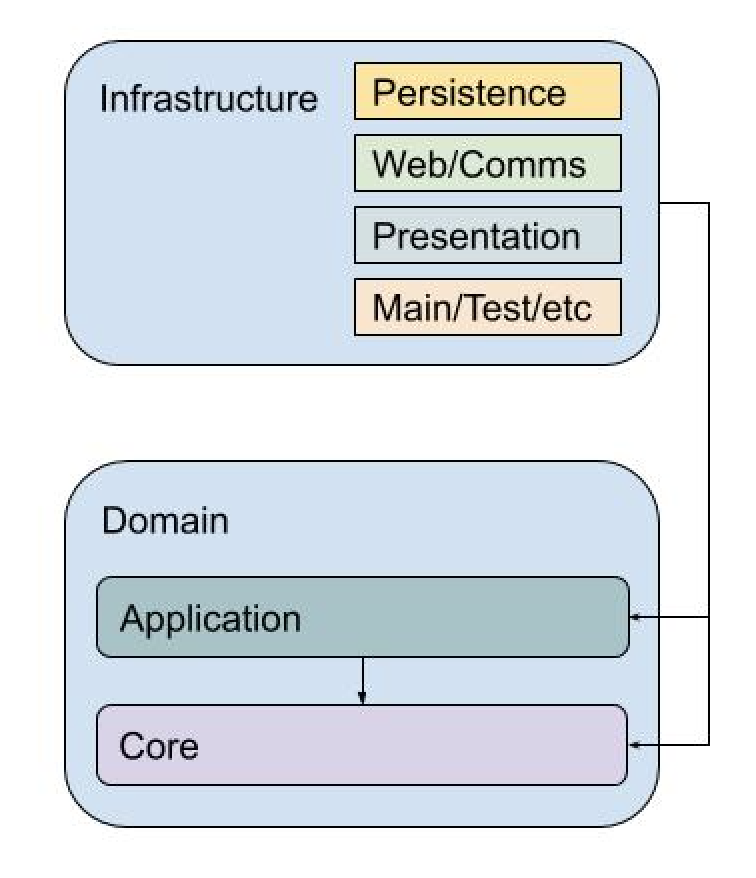

This is my review of [Clean Architecture](https://www.amazon.com/Clean-Architecture-Craftsmans-Software-Structure/dp/0134494164) by Uncle Bob. The book is undoubtedly a classic and I feel bad for not having read it earlier. I think it might have helped with a project or three. Better late than sorry for sure, and unlike other books I read too late (SICP primarily) I did feel I got a lot out of this book, and I came out a better developer on the other side. It certainly gave me a bunch of ideas to try out in [Jupiter](https://jupiter-goals.readthedocs.io/).

I must admit I've been skeptical in the past of this whole _clean code_, _clean architecture_, _design patterns_, etc part of the software engineering toolset. Not the things in themselves. But what I perceived as the bias towards "the enterprise" on the one hand, and towards the world of software consultancies and "project"-work on the other hand. It didn't help that I felt there was a lot of cargoculting in the mix too. As well as a feeling that this stuff is the _easy_ part of software engineering. As opposed to algorithms, machine learning, functional programming,  distributed systems, or other "hard" things. In any case, I got some wisdom in the end and decided to complete this part of my education before I slip too much into management. The fact that my side project Jupiter is hitting some architecture limitations is purely coincidental.

Anyway, back to regular programming. The topic of the book is software architecture. From the start, we're faced with the problem of what exactly is _software architecture_. Uncle Bob settles on the very wide "every important decision about the technical aspects of the system being built". Which has the nice property that it applies just as well to the 100 line utility script as it does to the Linux kernel, and just as well in the lowliest embedded system as in the loftiest distributed one. It's not very concrete, unfortunately. However the book essentially then focuses on the "architecture in the small" (if I may) of components and component dependencies and their proper delineation and orientation.

The book has a lot of chapters. This is great for snacking and context switching and getting quick wins, but bad for chapter-by-chapter summaries as I'm used to doing. So instead I'll offer a mish-mash of the actual lessons of the book. More work, but hopefully more useful too. I'll even throw in a diagram.

The main problem is that of selecting a good architecture for the system that we are designing. By good here we mean that the system is easy to understand and extend. A good architecture allows for this growth and change to continue. It’s interesting to note that architecture in the sense discussed is not about the functionality of the system, though the performance, security, etc non-functionals do drive it.

The biggest take away is a set of design principles that should be followed when designing a system. There are two classes of them: the lower-level and more commonly known [SOLID principles](https://en.wikipedia.org/wiki/SOLID), and the higher-level component-level principles. By component here Uncle Bob means something like a jar, or dll. But in many ways, it can be extended to larger-grained things like processes, or services. I’ll summarise them here:

* The release/reuse equivalence principle: the “unit” of release is the unit of “release”. That is, versioned
 libraries/components can be used and reused, not anything “smaller”.
* The common closure principle: a component should contain classes that change for the same reason.
* The common reuse principle; a component should contain classes that tend to be used and reused together.
* The acyclic dependencies principle: the dependencies graph between components should not have cycles - it should be
 a DAG.
* The stable dependencies principle: dependencies should flow in the direction of stability.
* The stable abstractions principle: a component should be as stable as it is abstract. Abstract components
 (consisting of interfaces, ABCs, etc.) should be stable, and concrete ones less stable.

The “Clean Architecture” itself is quite simple and follows from the principles. The main idea is to split the code into two layers - the inner “domain” layer and the outer “infrastructure” layer. The inner layer is the pure business logic of the system, while the outer layer handles things like persistence, communication, serialization, etc. Crucially the dependencies are from the outer layer to the inner layer. This is against the flow of control (and thus doing "Inversion Of Control" proper), and also from more concrete to more abstract, and from more variable to more stable.

The domain layer can be further split into two sub-layers. The first or “core” layer deals with the very abstract and high-level procedures of a business. Things like computing interest rates, or scoring a loan application. These things tend to change very slowly and would exist regardless of the physical instantiation of a system. They would look the same regardless of whether the system is a mainframe program, web service, blockchain contract, , etc. The “application logic” layer deals with the specific use cases of the current system. Things like a clerk verifying the loan documents of a potential client, or a salesman marking an account as inactive. These use cases tend to change with some frequency, and they are bound to the physical instantiation of a system. They would look different depending on whether the system is a mainframe program, an IoT controller code, or low-code automation.

The infrastructure layer has some canonical splits between presentation and persistence, but in general, here you can put anything which deals with the “world outside” the domain layer. From the database and the realities of turning entities into SQL rows in various tables to capturing user input and transforming it into commands of the various use cases. This layer is concrete and tends to change quite a lot. For that reason, it is called “dirty”. And the dirtiest of components is the main one. This is the component where the system starts - so perhaps it’s a class with the `main` function or the initial script file - and where it configures all other classes, linking them together, wiring the abstract with the concrete.

This means that in the domain layer we should have only _simple_ classes. There should be no ORM objects, no framework muddling, no concerns about serialization or input validation. Just simple classes doing simple things. Just like one would see in OOP tutorials as “simple” but “unrealistic” examples. I find this thing very attractive intellectually. First because it’s indeed “clean” of external libraries or frameworks - it’s just the application’s own code. But it also allows for the clear separation between the part that codes the business processes and the one which is just accidental complexity. Indeed, this part could just as well be plucked from its most likely webapp form, into a CLI application, or a testing suite.

As an implementation note (mostly gotten from other sources though), the way the dependencies are manifest is that the domain layer will define some sort of interface - say `LoansRepository`, which deals with the persistence of `Loan` entities. The infrastructure layer will implement the `LoansRepository` via a `PostgresLoansRepository` that will handle speaking with a properly configured Postgres instance. It could also define `MySqlLoansRepository` or `FlatFileLoansRepository`. The main component will then need to configure that the `LoansRepository` is resolved to the appropriate implementation for the run. This way, the domain layer doesn’t use anything from the infrastructure layer explicitly - it just says what it expects some other components to provide, and leaves it up to main and polymorphism to do the rest.

The last section of the book is the [catalogue of details](https://en.wikipedia.org/wiki/Catalogue_of_Ships). Essentially all the pieces of technology that we'd commonly understand as central to a system: databases, the web, frameworks, etc are relegated to mere details. Something which we should tightly keep in the application layer, but abstracted away to the needs of the domain layer, rather than running the show. This thing was both the most counterintuitive in the whole book, but also one of the _truer_ and influential of the bunch. Indeed, building something with the “clean” architecture even imposes the use of libraries more than frameworks. Which is a trend I’ve seen in the industry anyway of shunning _big_ and _all-encompasing_ frameworks like Rails or Spring and moving towards simpler frameworks for special use-cases (and perhaps there’s even some causality there to look at).

There's a link here to [hexagonal architecture](https://en.wikipedia.org/wiki/Hexagonal_architecture_(software)), the [onion architecture](https://medium.com/@shivendraodean/software-architecture-the-onion-architecture-1b235bec1dec) and even [domain driven design](https://en.wikipedia.org/wiki/Domain-driven_design) (to an extent). Indeed I've come to understand these architectures are a sort of large scale software design pattern for structuring the codebase. Ways in which it is useful to organize the classes/modules of a system, which we've observed to work and allow for easy understanding, reasoning, and expansion. On the other hand they're not set in stone. Like all patterns they are (or should be) guidelines - each system will be different and have goals and constraints such that the form of `$named architecture` it uses will look different from another's or from the standard. That's why I think the principles are the most important part in the end. You can get something radically different than the "Clean Architecture", but if it follows the principles, it would still be a good thing.

Besides reading this book I also watched a bunch of talks, both from Uncle Bob and from others. I'm linking them here because they serve to clarify, contextualizie, and expand the understanding of clean architecture. They are:

* [Clean architecture and design](https://www.youtube.com/watch?v=2dKZ-dWaCiU)
* [The principles of clean architecture](https://www.youtube.com/watch?v=o_TH-Y78tt4)
* [Implementing clean architecture in .NET Core](https://www.youtube.com/watch?v=IAcxetnsiCQ)
* [The clean architecture with Ian Cooper](https://www.youtube.com/watch?v=SxJPQ5qXisw)
* [Clean architecture with ASP .NET Core 3.0](https://www.youtube.com/watch?v=dK4Yb6-LxAk)
* [Clean architecture in Python](https://www.youtube.com/watch?v=18IqltQ4XE4)
* [Achieveing maintainability with the hexagonal architecture](https://www.youtube.com/watch?v=vKbVrsMnhDc)
* [More testable code with the hexagonal architecture](https://www.youtube.com/watch?v=ujb_O6myknY)
* [Hexagonal architecture in DDD](https://www.youtube.com/watch?v=u6oTg5oRH24)

I couldn’t end before mentioning the final chapter. It's a rundown of Uncle Bob’s past projects. It was a fun read in itself but two things stood out. One was that Bob's first gig was in 1970 programming a computer for some union's accounting needs. This was a mere 25 years after the first computers ever were built to help with the atomic bombs. That's a massive achievement to go from the smartest minds of a generation working on the cutting edge to a fresh highschool grad of 18 years working on an old (by then) machine in the mundane field of union accounting. The second was just how brutal the developer experience was back then. Punched cards, days long edit-compile-test cycles, assembler everywhere. I'm not 100% I would have found being a programmer so interesting during those times. I'm hooked on our modern tooling.

Anyway, that's it from me. There’s a lot more to the book, but hopefully, this has piqued your interest. Stay safe ‘till the next one.
