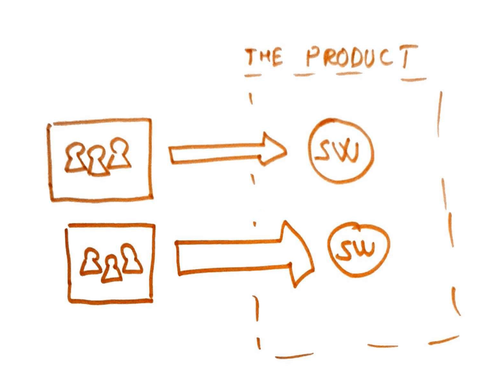
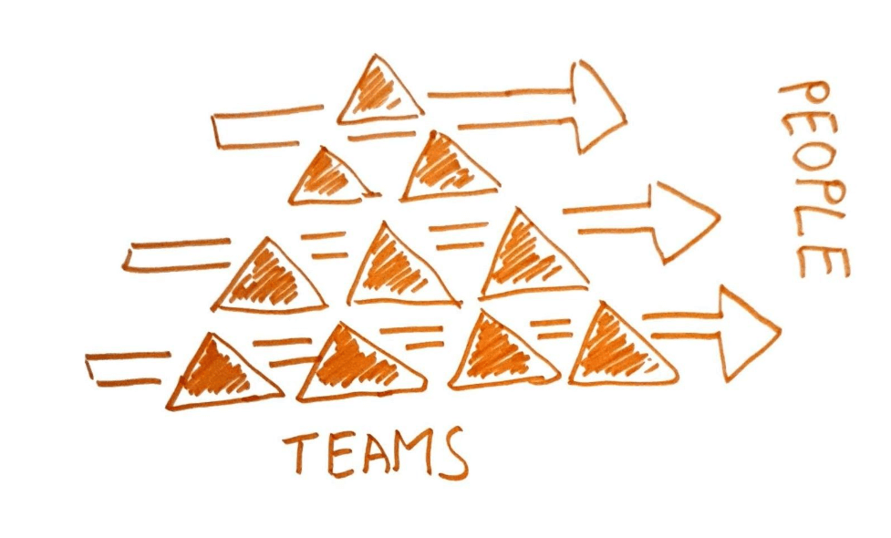
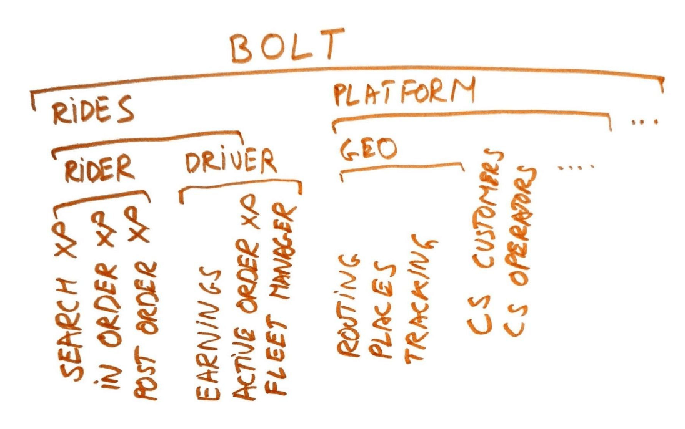
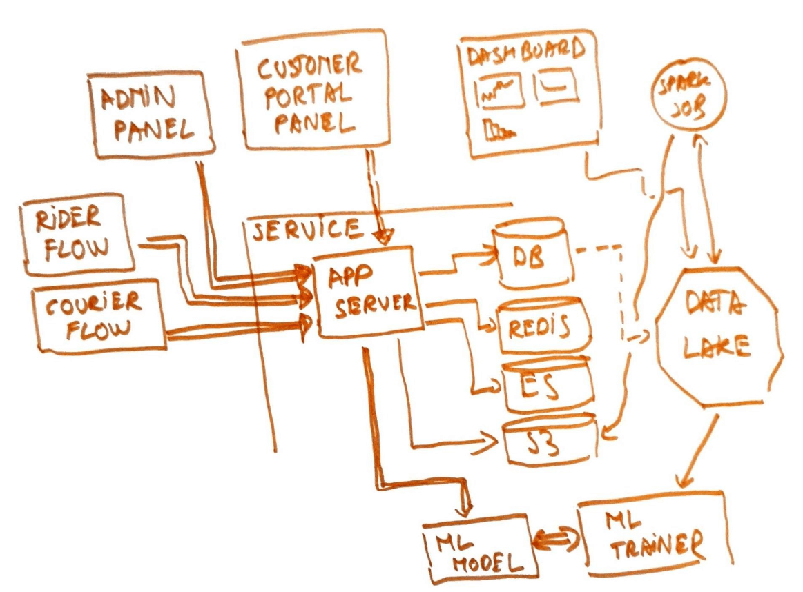
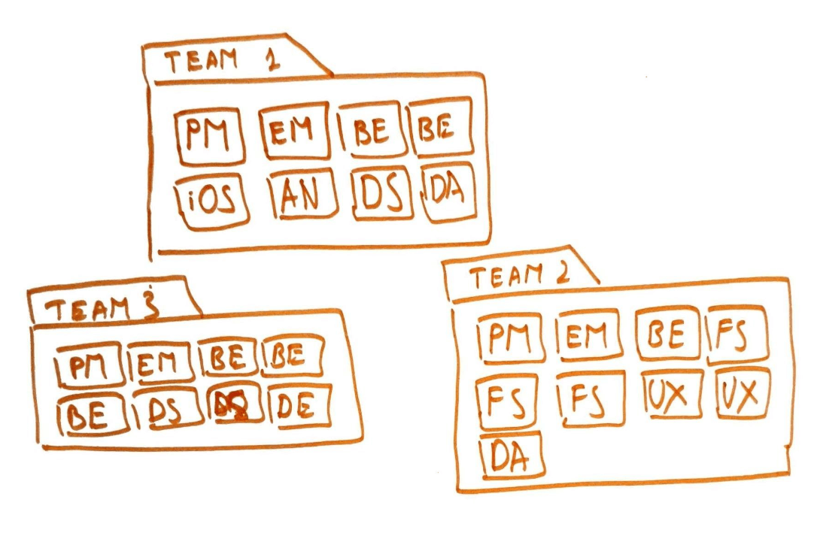
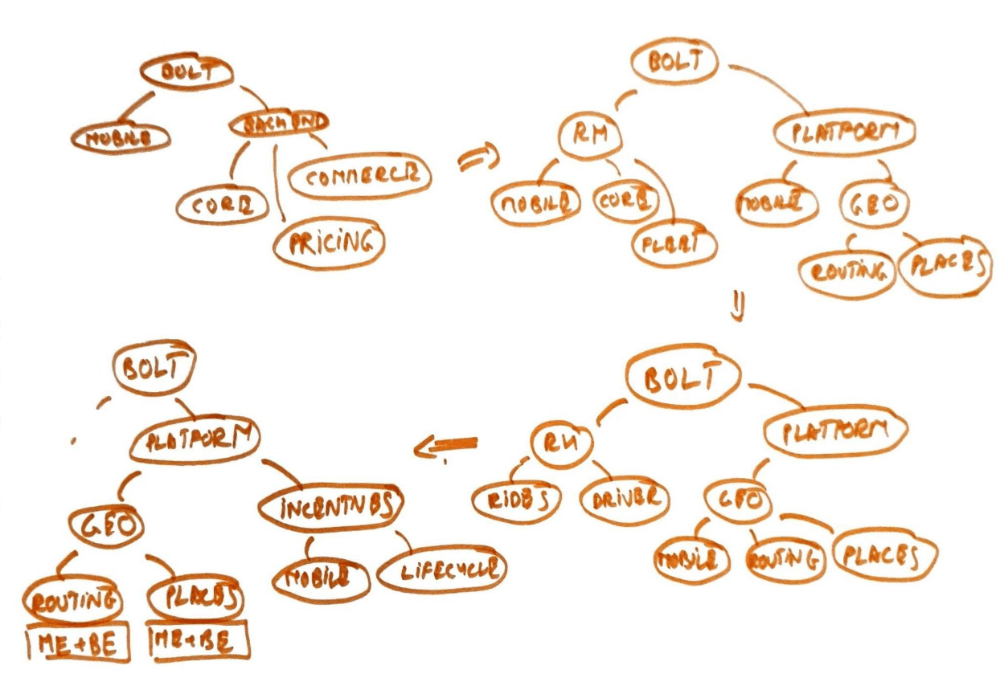

**Teams and team formation are a fundamental part of any organization. But getting them right is far from trivial. And
 there are a lot of ways to mess things up. So it's important to have a "correct" definition for them.**
 
In my time at [Bolt](https://careers.bolt.eu), I’ve been involved with managing, bootstrapping, and reorganizing my fair
share of teams. I made _all_ the mistakes. To save others from doing so I’ve written several internal guides. Now I’m
adapting and publishing them for a wider audience. I believe the lessons are _theoretically sound_ and should apply
across  companies and industries. Like the previous post on
[reading lists](../career/2022-05-22-my-suggested-reading), this one is geared towards a
manager audience. **Nevertheless, working in a badly set up team is a world of difference from working in a well set
up one.** Hence even as an individual contributor, this knowledge is useful. You’ll know what to look for and what to
avoid!

Here’s my best attempt at a short definition of teams done right - **in tech organizations at product companies, the
team is the unit of product delivery. It has a perennial lifetime in the organization. It has complete control over
a product vertical. It has corresponding control over the engineering components. It consists of a small group of
people working in a coordinated manner.**

Let's unpack this.

# The Unit Of Software Delivery

**The team is the unit of software delivery. Software in a business setting is a team activity. It is built and
maintained and operated by teams of people.**

In contrast, it is not individuals or squads that build software. Nor are large-scale structures like divisions or
the whole of “engineering” that build software. These are not safe, sustainable, or efficient configurations for the
long run. For one, a team can do more than a single individual and can think better than any one individual. On the
other hand, a team can actually do something and does not get drowned by coordination and synchronization costs like
larger groups do.

# Perennial Lifetime

**The team has a long and perennial lifetime in the organization.** It abstracts away the individuals which compose it.
Not in the sense of hiding them, but rather giving the rest of the organization a handle that withstands the
movement of people, temporary issues, vacations, etc.

In contrast, you can go the short-lived project teams route. Or do swarming on projects, or try the consultancy model.
But these are not teams in the sense above and should be used for specialized tasks.

Teams can start and end, but as long as we have a particular product need, we should have a team handling it.

# Complete Control Over A Product Vertical

**The team has complete control over a particular product vertical.** It can be a very narrow vertical, but it needs to
be something distinct and non-overlapping with the other parts.

Control of a domain here means that the team is tasked with solving a particular problem and has the autonomy to set 
objectives, establish metrics, devise strategies, prioritize and execute, own vendor relationships, etc.

It is subject to limited oversight from the rest of the organization, mostly expressed as reviews, alignment to
strategic objectives, budget/ROI constraints, etc.

In contrast, having a top-down approach to these aspects is not scalable, nor is it efficient. The higher levels of the
org offer context and strategic direction, but should not manage at the level of a team. Ditto, shared or diffuse
ownership is a recipe for trouble. When things are good folks are going to struggle to work on things, and when
something goes wrong the hot potato will be passed along.

**The effect we wish to achieve in the end is to minimize dependencies with other teams and maximize the ability of
the team to work independently.** When coordination is required, it is achieved by providing a service, rather than a
tight "collaboration". Amdahl’s law applies just as well to teams as it does to computers.

# Complete Control Over Engineering

**The team has complete control over the specific engineering-level systems that power the corresponding product
vertical that the team owns.**

Control of the domain here means that the team is tasked with building and operating whatever aspect of the product 
they need in order to meet their product objectives.

It is subject to limited oversight from the rest of the organization, mostly expressed as reviews, following best
practices, using the common infrastructure-level tooling, aligning with wider architecture constraints
, participating in migrations, etc.

In contrast, we do not want distributed ownership here, with specialized mobile or DBA or data teams working 
in a "consultancy" or "per-project" fashion. It does not scale, is not efficient, and is subject to
bandwidth limitations of the provider teams.

For example at Bolt, systems a team would normally own are:

* Services — includes the application servers, as well as operational DBs, Redis instances, queues, and all the other
 resources attached to a service
* Admin panels — the micro frontends which allow operators to control and inspect the operation of the systems
* Special internal apps — special internal apps that allow specialist operators to perform their specific jobs
* External apps — the micro frontends or whole apps which allow external users to interact with Bolt
* Mobile apps — the Android&iOS apps which our users and partners predominantly use to interact with us
* Dashboards — the Looker dashboards and associated code (SQL) for them
* Spark jobs & analytics systems — the various Spark jobs, periodic SQL scripts, etc that crunch data in the
 background and publish it to services, admin panels, dashboards, etc
* ML models — the various ML models the team employs to make decisions, help with predictions, run detections, find
 anomalies, etc.

All of the above are organised in ways which allow multiple teams to own separate sections of the codebase, even if
they’re working in an otherwise monolithic system.

Given that, ownership here means that:

* The team designs the system
* The team codes & builds the system
* The team operates the system in the short term, which translates to looking at metrics, responding to alerts
, thinking about sizing, participating in on-call, etc
* The team continuously improves the system as a result of product and engineering-led developments
* The team operates the system in the long term - plan capacity, prepare for 10x scale requirements, migrate to new
 technologies, etc
* The team does this across all the various compute contexts - from services to ML models

Depending on how a particular engineering organization is set up, there are some natural boundaries that crop up.
One is towards the infrastructure layer as maintained by a “platform” or “tools“ group. Teams build their
systems by using the tools provided by this group. Where they are insufficient there’s a discussion about going
off the beaten path which may include explicit plans to contribute any developments back to the wider community.
The other boundary is towards the product layer represented by more distant teams who code in an older monolith.
In some cases, a team builds inside monoliths owned by other teams and needs to be mindful of that.

# A Small Group Of People

**A team is a small group of people working in a coordinated manner.** The ideal team size is between 6 and 10 people
. They can belong to multiple reporting lines, as long as they work together in a consistent fashion and consider 
themselves as a unit.

In contrast, if the team is too small it does not manage to have enough power, it is very susceptible to people
movement, and it doesn't accurately manage to provide an abstraction to the rest of the organization. On the other hand,
a team that is too big is swamped by coordination costs, cannot effectively gel, and fights against human psychological
limits.

The ideal team composition is determined by the ownership needs of the team, but it can consist of: a Product Manager,
an Engineering Manager, a Data Analyst, a Designer, a number of backend engineers, a number of mobile engineers, 
full-stack engineers, a data scientist, a data engineer, a QA engineer, etc.

The reporting lines do not matter as much and it’s normal to have 2-3 of them completely separate up to VP or CEO level. 
What matters is that folks work as a team with all the attributes from above.

There's a soup of responsibilities across the engineering and product spectrum, and while some individuals are primary
owners of some, everyone has some shared ownership here! An engineering manager needs to care about the product
direction, even if they’re not the principal owner of that, just as much as a product manager needs to care if a team
member is having performance issues.

Overall the sum of these people should be between 6 and 10 people.

Even in this ideal discussion, we need to acknowledge some realities.

* There might not always be enough work in a team, or enough organizational maturity to support all types of
 contributors in a team
* The core group of a team is traditionally formed of a PM, an EM, and the backend/mobile engineers
* Other types of contributors can be shared from a pool of people associated with the wider group

The guiding principle is that these specialized teams should be placed closest to where they are needed and
evolve to move to where the needs are. Historically we have done the following:

* Initial stage ⇒ vertical aligned backend teams, with a global pool of mobile devs, QAs, data scientists, etc
. helping out
* Scaleup stage ⇒ vertical aligned backend teams, with product-line pools of mobile devs, QAs, data scientists, etc
. helping out
* Current stage ⇒ vertical aligned group level teams, with local pools of mobile devs, QAs, data scientists, etc
. helping out
* Final stage ⇒ significant numbers of full-stack teams, with domain level pools of mobile devs, QAs, data scientists
, etc

The graph below shows via arrows the structural evolution of our organization and the four stages highlighted.

# Other Types Of Teams

The above discussion assumes very much that we're speaking about "stream aligned teams". These are the classical
teams that own a very narrow vertical of the product. Other teams one can find in an organization are "platform teams"
or "complicated subsystem teams". Regardless, most of the same principles above apply here. The book “Team Topologies”
goes into more details on these other types of teams.

# Outro

There you go! Quite a lot of material about teams. And there’s more for sure. Entire books have been written on the
topic and we’re still not in a place where we’ve mastered this as an industry.

Here are some references for further reading: 

* [Peopleware](../_book_reviews/2019-04-20-peopleware-review.md)
* [Inspired](https://svpg.com/inspired-how-to-create-products-customers-love/)
* [Team Topologies](../_book_reviews/2021-04-25-team-topologies-review.md)
* [Autonomy Without Chaos](https://www.youtube.com/watch?v=RKgZmHhSD9I&list=WL&index=2)
* [Transform Engineering Culture Without Losing Control](https://www.youtube.com/watch?v=HGf5oTD4Buc&list=WL&index=3&t=619s)
* [Team Topologies Talk](https://www.youtube.com/watch?v=haejb5rzKsM&t=1268s)
* [Designing Engineering Organisations](https://jacobian.org/2021/jan/5/designing-engineering-organizations/)

I hope you found something useful in this post, and see you in the next one.
