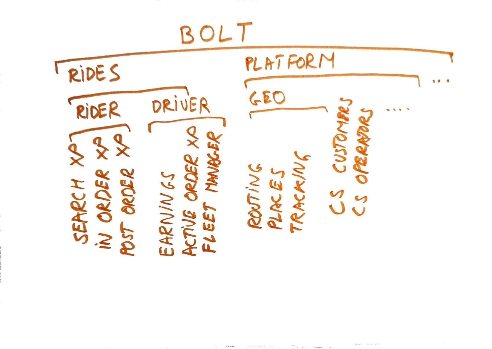
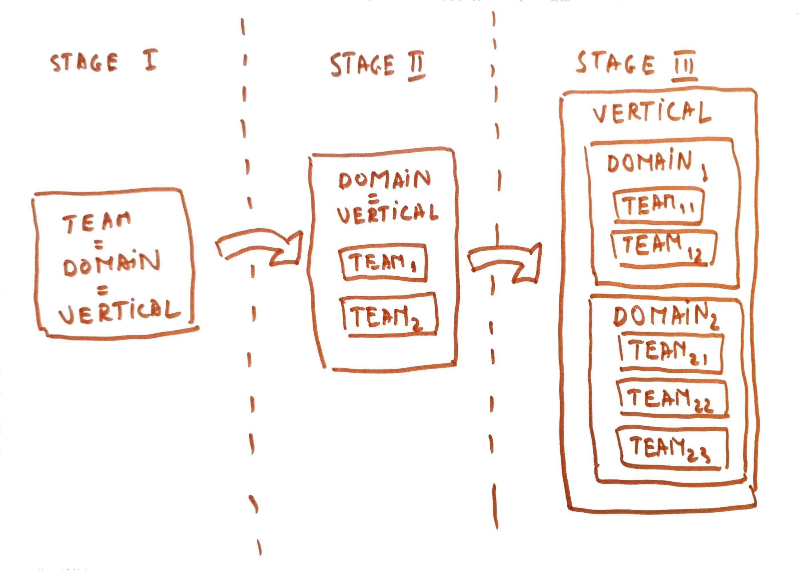
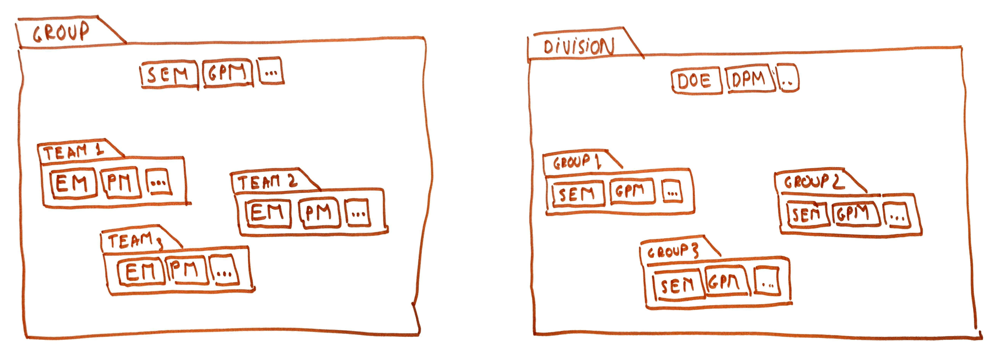
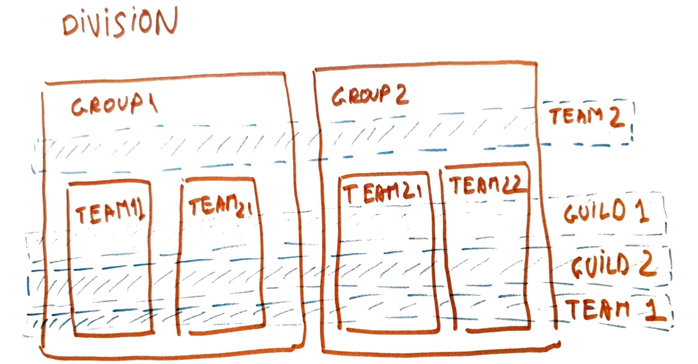

**[Teams](https://horia141.com/career/2022-06-05-the-notion-of-teams) in companies don’t exist in a vacuum.
Rather, they are part of a larger organization. And getting this _right_ is just as important and
hard as getting teams right.**

Like in the case of teams, there are certain patterns that work. And certain approaches that the industry has
settled on. Unlike teams, organization construction depends much more on the company’s product structure. 
Furthermore, as the product structure evolves, the organization structure does as well. Which adds a whole layer of
complexity to the task faced by a manager.

In my time at [Bolt](https://careers.bolt.eu), I have done quite a bit with this work of organization construction.
I’ve been both on the side of it happening to me via a reorg. And on the side of proactively changing things. 
Like with teams, I made all the mistakes. So I’m also publishing this guide for a wider audience. 
I believe the lessons are theoretically sound and should apply across companies and industries. Like the previous
posts, this one is also geared towards a manager audience. **Nevertheless, working in a badly set up organization is a 
world of difference from working in a well set up one.** Hence even as an individual contributor, this knowledge is 
useful. You’ll know what to look for and what to avoid!

**Coming back, the most common form of organizing humans is in [hierarchies](https://en.wikipedia.org/wiki/Hierarchy). 
Companies, armies, and religious organizations are hierarchical. Hierarchies pop up in how we think of the product too.
And in how we organize ourselves to build the said product. Ideally, there should be a lot of overlap between the two.**

Let’s unpack this.

# Product Hierarchies: Domains & Verticals

**A domain is a coherent unit of product ownership. It is the vertical slice of product control referred to in 
[The Notion Of Teams](https://horia141.com/career/2022-06-05-the-notion-of-teams).**

Depending on the business size, these domains can range from very narrow to very wide. A very narrow domain might be the checkout page in a large online retailer’s payment flow. A very broad domain might be the driver experience in a mobility startup.
 
When they are broad, domains can have sub-domains and sub-sub-domains. These are in turn also domains in their own right. Some notion of product coherence binds them together. So the vehicle routing domain is much closer to geo locations domain than it is to something like payments processing. So another way of looking at it is that domains cluster together in larger units.
 
The top-most and broadest domains are usually called business lines or verticals. In the case of Bolt, these are things like ride-hailing or delivery. For Google, they might be search or YouTube. For Microsoft, they might be Office or Azure.

# Management Hierarchies: Teams & Groups & Divisions

**The smallest unit of software delivery is the team.** When teams get too big they tend to split into new teams. This process can go on recursively. In the end, you get groups, divisions, and departments. There is little standardization in naming to be honest. They name something bigger than a team and smaller than the whole organization.
 
Reporting lines cause extra complications. To give the example of Bolt, it is functionally split. All engineers 
ultimately report to a single person, who then reports to the CEO.
All product managers report to another person. All CS agents to a third one. And so on. This means that 
teams, groups, and divisions in general cross reporting lines. Often the greatest common ancestor is the CEO. 
It is a common pattern. and even very large enterprises like [Apple](https://www.apple.com/leadership/) function like this.

In contrast, some companies have general managers. After a “level” a single person manages most product, engineering, business, and even financial aspects of a division. They act like a CEO and sometimes they even have that 
title (think “[the CEO of AWS](https://www.aboutamazon.com/news/company-news/aws-announces-next-ceo)” or 
“[the CEO of YouTube](https://www.linkedin.com/in/susan-wojcicki-b136a99)”). The mini-organisations thus set up can 
range from tens to thousands of people.

# Mapping Product Hierarchies To Management Hierarchies

**The interaction of product and management hierarchies is complex. As a rule, the product hierarchy should determine the management hierarchy.**
What this means is that if we have a particular product domain, there should be a single management 
unit with ownership over it. This is known as [Conway’s Law](https://www.thoughtworks.com/insights/blog/demystifying-conways-law)
(or rather in this form, the [Inverse Conway Maneuver](https://www.thoughtworks.com/radar/techniques/inverse-conway-maneuver)).

In practice, the smallest domain should be handled by a team. A group should handle a domain with several subdomains. But of course, there’s a lot of variation. There are verticals that are handled by a single team, and sometimes you can have domains with several teams working on them. Such things happen during domain splits for example.

There is a natural evolution. Especially on the product side, an initial team might own a single vertical. As the vertical gathers momentum, several teams form, even if the product separation isn’t there yet. In time teams work in the several domains which are part of the vertical.

# Team Leadership - Interplay With Hierarchy

A direct result of the functional separation is that **there is no single leader of a team**.
Instead, there are leaders for the various facets of ownership for the team - product, engineering, operations, support, community, etc.

For an engineering team, the classical leaders are the product manager and the engineering manager. Sometimes there is a separate technical leader too.
 
Some leadership structure is attached to the bigger hierarchical units like groups or divisions. Like in the case of teams, these can and do occur on separate reporting lines. At these higher levels, other sorts of leaders appear - a Data Analysts Manager, a Data Science Manager, a Design Manager, or an Operational Manager.

But common setups are - using Bolt terminology:
 
* A group consisting of several teams led by a Senior Engineering Manager (SEM) and a Group Product Manager (GPM). All the EMs Managers report to the SEM and all the PMs report to the GPM. A high-level engineer can report to the SEM and fulfill various roles as the
* A division consisting of several groups is led by a Director of Engineering (DOE) and a Director of Product Management (DPM). All the SEMs report to the DOE and all the GPMs report to the DPM. High-level engineers can report to the DOE and fulfill various roles, and other managers and group managers for the various specialties can also be part of the division leadership team.

# The Interplay Between Processes And Hierarchy

Because teams don’t exist in a vacuum, but rather in an organization, the organization exerts influence on the teams. This can be implicit or explicit.

For example, you can see things like:

* Team-level practices: bug bashes, weekly lunches, banging a gong on occasions, etc
* Group-level practices: roadmap planning, retrospectives, etc.
* Division-level practices: approaches to metrics tracking, etc.
* Organization-level practices: performance reviews, quarterly planning, etc.

# Cross-Cutting Concerns

A hierarchy does not allow for all the organizational needs of the group. There are specific concerns that end up being cross-cutting to a hierarchy established to map to the product one. For these, we have secondary organizational units, in the forms of guilds, workgroups, or even fully-fledged teams.

They serve various purposes, from forming communities of practice to enforcing processes to helping with the delivery of large-scale processes

# Outro

There you go! Quite a lot of material about teams of teams. And there’s more for sure. Entire books have been written on the topic and we’re still not in a place where we’ve mastered this as an industry

References:

* [Conway’s Law](https://www.thoughtworks.com/insights/blog/demystifying-conways-law)
* [Inverse Conway Maneuver](https://www.thoughtworks.com/radar/techniques/inverse-conway-maneuver)
* [The Notion Of Teams](https://horia141.com/career/2022-06-05-the-notion-of-teams)
* [Steven Sinofsky on functional vs unit organization](https://medium.learningbyshipping.com/functional-versus-unit-organizations-6b82bfbaa57)

I hope you found something useful in this post, and see you in the next one.
