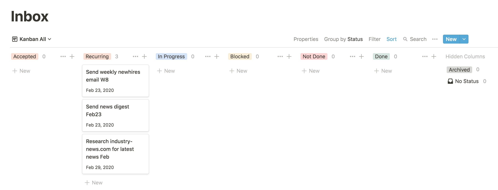
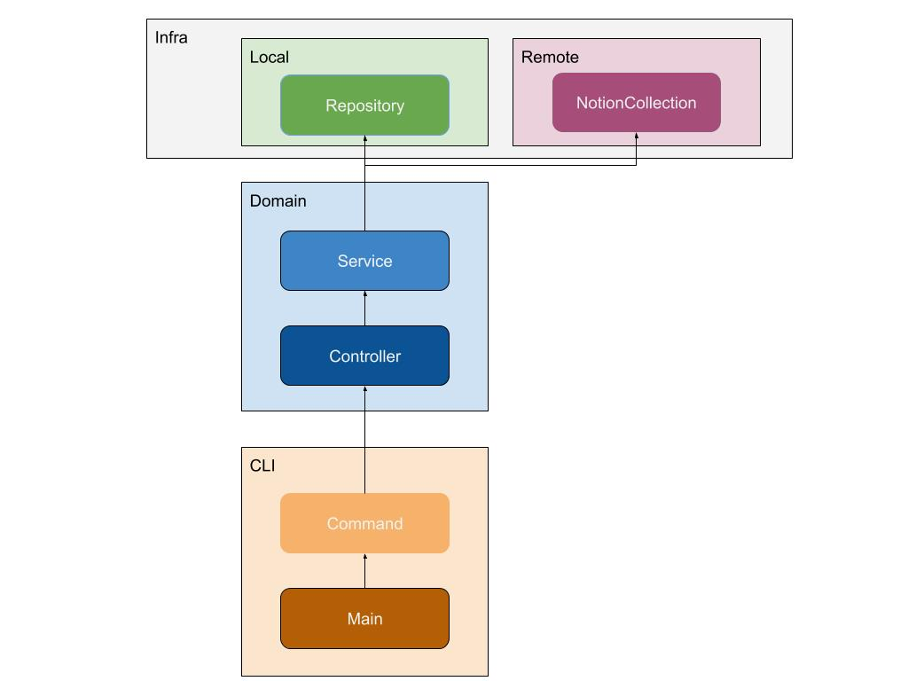

<span>Photo credit <a href="https://unsplash.com/@jimo?utm_source=unsplash&amp;utm_medium=referral&amp;utm_content
=creditCopyText">James Barnett</a> on <a href="https://unsplash.com/s/photos/script?utm_source=unsplash&amp;utm_medium=referral&amp;utm_content=creditCopyText">Unsplash</a></span>

In this latest post in the [Jupiter](https://jupiter-goals.readthedocs.io/) dev log series I want to speak about the software architecture of Jupiter. It's a topic I've wanted to write about for a while actually, but somehow never got the will to do it. With the limited time, I have for working on this, writing a new feature always trumped writing about writing a new feature. But I’ve finally decided to bite the bullet and commit to something because I recently finished reading and reviewing [Clean Architecture](https://horia141.com/clean-architecture-review.html). It has made quite an impression on me and made me think in a new light about some of the design decisions I made with Jupiter. So this post will be equal parts presentation and critique. The project has also reached a _respectable_ `15 KLOC` of code, so it has enough heft that the discussion isn’t strictly academic, and might prove useful to other folks too!



## Architecture Cornerstones

I find the term “architecture” quite fluid. I've seen it mean everything from the choice of what patterns are used in the source code of a project, to building a system as a webapp, to using a microservices “architecture”. Clean Architecture focused a lot on “architecture in the small”: codebase level organization of classes within components and dependencies between components. But I liked the very general notion that ["architecture is the important decisions"](https://martinfowler.com/architecture/) so I’ll cover the _big decisions_ or _cornerstones_ too.

Some of the choices I made will raise some eyebrows. They aren’t ones one would usually make for a _product_. They even seem both explicitly tailored at _programmers_ and actively _hostile_ to non-programmers. The underlying theme is that they made my life easier, and allowed Jupiter to quickly become usable and useful. Indeed, I started making use of it as my main tool as soon as a week after the `git init` was done. Had I went with a more _traditional_ approach I would have statistically speaking never finished it and never used it. I’m happy with the outcome of these choices, but I realize they aren’t and cannot be final if I ever want user #2! Anyway, that’s about all for justification - take the choices as they are henceforth.

The first architecture cornerstone is that Jupiter is a self-hosted and locally operating CLI application. This means that a user (me) downloads a _packaged and versioned release_ of the application and uses it locally to manage local data. I use Docker as packaging and releasing infrastructure, even if this sort of use-case isn’t its main one. Of course, [Notion.so](https://notion.so) plays a big role as the nice user-interface. Jupiter interacts with Notion as a client which periodically checks to see if there’s something to be _done_. When I’ll add other integrations - with Google Calendar, Spotify, etc, the same interaction patterns will be followed. But for now, there isn’t an “always-on” component to Jupiter to act as a counterpart to these services. Rather a user’s install of Jupiter does something only as a result of the user asking it to!

The second architecture cornerstone is the use of text files as storage and reliance on git for persistence and cloud sync up. Storage itself - whether text files, or databases, or in the cloud, is an implementation detail in the end. Though it is a very _visible_ one. But relying on mechanisms outside the control of the app for persistence and sync up is what essentially makes the app a “local” application rather than a “cloud” one.

The third architecture cornerstone is that the CLI application has a command-driven interface. It essentially presents a lot of commands to the user through which they do their work. Think `git` here. So there are commands like `jupiter sync` or `jupiter smart-lists-create`, etc. Jupiter is running only when such a command is invoked. If you run `jupiter --help` you’ll see a lot of commands. Suspiciously looking like a REST or RPC API even.

The fourth architecture cornerstone is that there are multiple ways of interacting with the system - the CLI and Notion. And they have separate storages, which need to be explicitly synchronized. Indeed, most of the interaction will occur through Notion. But any change made there won’t be _seen_ by the local install. You need to run a `jupiter sync` command for that to happen. At first glance, this seems like simply a functional concern, but it does end up influencing several architectural aspects. From how code is organized to allow abstracting away the need for synchronization, to a focus on idempotence which permeates the codebase. I run the command about once a week, therefore the [eventual consistency](https://en.wikipedia.org/wiki/Eventual_consistency) reconciliation window can get quite big!

## The Code

This draws us down into the code for the first time. Commands imply a great deal of regularity in the way one interacts with the application - issue a command, wait for processing, observe results, repeat. And this indeed translates to the code. The app looks like any system for answering requests. Which in computer parlance we call _a server_! It’s not a _web server_ like most things are these days. And it’s not always running like them. But it's the same kind of thing in the end, and to a user it is transparent. As a historical aside - the first web applications were built with a server feature called [CGI](https://en.wikipedia.org/wiki/Common_Gateway_Interface) - which allowed it to invoke a binary on the same machine. Naturally, a new process was spawned for each request, much like we’re doing here

In the prehistory of the project, there was no code architecture to speak of. Or rather it was the venerable [big ball of mud](https://en.wikipedia.org/wiki/Big_ball_of_mud). The first-ever tagged commit [v0.0.1](https://github.com/horia141/jupiter/tree/v0.0.1/src) still had a lot of this. There were a bunch of files, all independent, all entry points, and with a very minimal structure around it.

But things have evolved quite a lot. And as of release [v0.6.1](https://github.com/horia141/jupiter/tree/v0.6.1/src) things look _much_ different. For better or worse we have this component structure:



A listing of the source tree hints at this too, but it isn’t a 1:1 mapping with the above image.

```
$ tree -L 3 src
src
├── command
│   ├── __init__.py
│   ├── command.py
│   ├── garbage_collect.py
│   ├── generate_inbox_tasks.py
│   ├── inbox_tasks_archive.py
│   ├── ...
│   └── workspace_show.py
├── controllers
│   ├── big_plans.py
│   ├── common.py
│   ├── garbage_collect_notion.py
│   ├── ...
│   ├── vacations.py
│   └── workspaces.py
├── jupiter.py
├── models
│   ├── basic.py
│   └── schedules.py
├── remote
│   └── notion
│       ├── big_plans.py
│       ├── common.py
│       ├── inbox_tasks.py
│       ├── infra
│       ├── projects.py
│       ├── recurring_tasks.py
│       ├── smart_lists_manager.py
│       ├── vacations_manager.py
│       └── workspaces.py
├── repository
│   ├── big_plans.py
│   ├── common.py
│   ├── ...
│   └── workspace.py
├── service
│   ├── big_plans.py
│   ├── ...
│   └── workspaces.py
└── utils
```

I’ll go into a bit more details around what’s happening. There are three large components to the system, each split up into several sub-components.

* CLI:
  * This component handles the CLI functionality of the application. It concerns itself with arguments parsing
, outputting things to the console, etc. It’s in fact the only component aware that this is a command-line app, as opposed to a web or desktop one.
  * The `Main` subcomponent is the entry point to the application - the uncleanest of unclean components. It’s actually
 the `src/jupiter.py` file. This essentially handles wiring everything up together in the application - all repositories, commands, etc - and dispatching from the user’s intent to a command to execute.
  * The `Command` subcomponent contains classes for handling each of the commands for the application. Here we’ll find a
  class like [`GarbageCollect`](https://github.com/horia141/jupiter/blob/v0.6.1/src/command/garbage_collect.py#L14) which implements the `jupiter gc` command, and indeed, one for each command. The logic is very thin, however. A command simply parses arguments and invokes an appropriate domain-level controller with the required data.
  * There’s even a small home-brewed framework of sorts since each command is so regular. Checkout [`command.py`](https://github.com/horia141/jupiter/blob/v0.6.1/src/command/command.py) and [`jupiter.py`](https://github.com/horia141/jupiter/blob/v0.6.1/src/jupiter.py) for details.
  * Overall I’m pretty happy with this part of the codebase. It’s self-contained, modular, and deals with exactly what
  it needs to.
* Domain:
  * This component handles the business logic of the application. It’s split across entities lines - projects, inbox
  tasks, big plans, smart lists, etc.
  * The `Controller` subcomponent contains the so-called use-cases of the application. Here is where the magic happens many times - the business logic itself resides here. Here we’ll find a class like [`InboxTasksController`](https://github.com/horia141/jupiter/blob/v0.6.1/src/controllers/inbox_tasks.py#L31) which implements the CRUD operations on inbox tasks. There are also some specialized controllers like [`GarbageCollectNotionController`](https://github.com/horia141/jupiter/blob/v0.6.1/src/controllers/garbage_collect_notion.py) or [`SyncLocalAndNotionController`](https://github.com/horia141/jupiter/blob/v0.6.1/src/controllers/sync_local_and_notion.py) which frankly do the _core_ and logic-heavy work. These are the reasons why the application was built in the first place - all the other controllers offer support.
  * The `Service` subcomponent contains the lower-level entity-specific logic. There’s one service class - like [`InboxTasksService`](https://github.com/horia141/jupiter/blob/v0.6.1/src/service/inbox_tasks.py#L22) - for each entity. This is not exactly business-logic, nor is it storage or infrastructure code. What happens here usually is that mutations are applied to both the local storage and to the Notion storage. Similarly, the critical synchronization code between Notion and the local storage resides here. The need for such a layer - an architectural thing - is pushed by the functional choices. Though I admit the naming of _service_ isn’t quite right.
  * I’m not 100% happy with the `Controller <> Service` separation. In the future, I’ll probably merge the two, reify each use-case as a separate controller class, and figure out some better abstractions for Notion to local syncing.
* Infra
  * This component handles the interaction with the “outside” world. It’s split across entity lines - with projects, inbox tasks, etc. getting their own classes here, and along the local vs Notion divide.
  * The `Local` subcomponent contains the classical repositories that code in the domain component uses to interact with persistent storage - for now text files on disk. It’s what you would expect these be. For example, there is an [`InboxTasksRepository`](https://github.com/horia141/jupiter/blob/v0.6.1/src/repository/inbox_tasks.py#L47) class with methods such as `create`, `load` (by id), `save`, `find_all`, etc.
  * The `Remote` subcomponent contains code for interacting with Notion in a principled way. There are a bunch of utility classes that abstract away the raw Notion client and provide some shielding for when the official SDK will need to replace the current one. But the main abstraction is the Notion “collection”. For example, there is an [`InboxTasksCollection`](https://github.com/horia141/jupiter/blob/v0.6.1/src/remote/notion/inbox_tasks.py#L50) class which deals with both setting up the Notion-side page structures and collections, but also mapping between Notion rows and in-memory data.
  * Overall I’m decently happy with the architecture of this part of the code. But the actual code-quality could be improved. There’s some lower-level code here which could be made better, more generic, and more robust. But the biggest issue is probably that there’s a lot of business logic about Notion such as what pages there are, how collections are formed, and what views they have, which are coded at this lower level, rather than in the “Domain” component.

When you invoke a command such as `jupiter inbox-task-set-name --id 10 --name “Foo”`, the following happens:

* The `src/jupiter.py` script is invoked and all the repositories, collections, services, controllers, and commands
 get initialized and wired together. The program decides which command to invoke based on the name of the command.
* The `InboxTasksSetName` classes’ `run` command gets executed, which parses and validates command line arguments, and
 passes control over to the `InboxTaskController`.
* The `InboxTaskController`’s `set_inbox_task_name` method gets invoked, which simply forwards the call to the `InboxTaskService`.
* The `InboxTasksService`’s `set_inbox_task_name` method gets invoked. This loads the respective inbox tasks via the repository then applies the change to the entity, then saves the change locally. Finally, it applies the change remotely on Notion side.
* The operation is not transactional between the local and Notion side. The latter change might fail, and a `jupiter sync` will be needed to reconcile the two.
* This is an example of a simple CRUD operation. More complex `sync`, or `gc` commands have most of their logic in the controller, which orchestrates the changes across multiple entities.

## Some Nice Things

To wrap the previous section off, there are some unambiguously good things about how the system as it is currently organized.

It is “layered”, and each layer deals with a specific thing. The directories structure better represents these layers, but each layer also is a specific component. There are no cycles between the layers.

It has a notion of controllers which capture the use-cases of the application. The logic is shared with services, and it’s quite clear what the application is about and can do.

It uses dependency injection quite heavily. Not IoC though, as the flow of control still follows the flow of dependencies. Regardless, the `src/jupiter.py` looks like a regular modern web application’s setup code.

It isn’t tied too hard to the CLI app paradigm and can relatively easily be extended to any “request-handling” interaction mode.

## A Principled Critique

Let’s look now at the component-level principles presented in the book, and how the current system stacks against them.

The release/reuse equivalence principle is weakly followed. The application is monolithic, hence we can’t speak of reuse, and releases happen for the whole thing. In a future in which we have multiple notions of clients, the controllers, services, and other parts can be packaged independently, and various clients (or servers) could make use of them. It is versioned, however, and it’s using [semantic versioning](https://semver.org/).

The common closure principle is quite well followed, by virtue of separating things into layers. Big changes have tended to affect things across layers, but once the thing becomes more mature I’ll expect the bigger chunk of work to be localized to a layer.

The common reuse principle is quite well followed, by virtue of separating things into layers. Again, it’s not a situation of reuse we’re looking at so far. However, because dependencies flow from more abstract to more concrete, rather than the other way around, reuse will be tricky for certain situations if future improvements aren’t done.

The acyclic dependencies principle is quite well followed. There are no loops in the dependencies.

The stable dependencies principle is weakly followed. Business logic classes routinely depend on infrastructure level concerns, which tend to change for various reasons (Notion API changes, updates in storage, etc.). Where it’s most hurting is the dependence on data-types exported by these packages, but functionality tends to be neatly abstracted.

The stable abstractions principle is weakly followed. Abstractions aren’t well-reified in the code - there’s a lot of dependencies expressed in terms of concrete classes. Since this is Python it still allows for decent substitution if we wanted, even though the type-checker would complain.

## Future Improvements

In this section, let’s look at some architectural improvements which flow naturally from the previous discussion.

The biggest future improvements are around implementing more of the clean architecture as given in the book. This means at the minimum inverting the flow of dependencies. We can add a bunch of interfaces and types in the domain part, that the other more “concrete” components depend on and implement. `src/jupiter.py` can still wire them up well.

There are very few clear “Entities” encapsulating the clear and profound business logic. And that’s a shame because there are so many such concepts - from ids to schedules. I’d like to separate this sort of central logic and reify entities and what can be done with them better.

All of the major objects are somehow containers of objects and singletons. Even in the business logic layers, it’s all about “repositories” doing things rather than entities themselves doing the things. For example, a smart list item doesn’t get to add its own tag, rather the smart list service adds a tag to a smart list item entity. It’s all very “procedural”. I’d like to change this and move some of the logic to the entity classes themselves.

Controller/use-case logic is kind of thin, and I think some of it can be centralized there instead of “services”. Some better abstraction for syncing between Notion and local will be needed to avoid repetition and/or missing out on some cases.

Too much business-logic about Notion is embedded in the lower-level `Infra/Remote` subcomponent. It should offer a more flexible interface, which the `Domain` component uses to build the appropriate structures.

Changes tend to be quite vertical, from the smallest to the largest. I’d prefer it if only larger changes - those warranting a minor version bump - would be thus, and smaller changes would completely be isolated in a component.

## Conclusion

This about wraps it. Hopefully, it’s been an interesting and useful read. I expect the doc to reflect the reality of the codebase for quite some time. But as with everything, the _truthness_ of this document will slowly start to erode as I make improvements, extend functionality, and refactor the codebase. However, the major elements I expect to stay in place for a long-long time, and everything else to gradually move in the direction highlighted in the “to improve” sections of the doc.

Stay safe and see you next time!