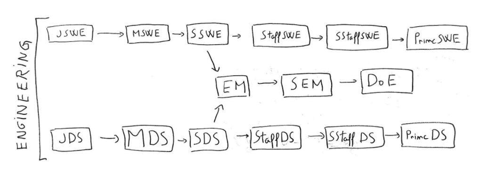

In a previous article in this series, we spoke about the types of software companies. Now it’s time 
to turn our attention to how these companies organize their workforce. It turns out the tech industry
has standardized the type and the scope of work engineers do to a large degree.

The major things we’ll be looking at are _job families_ and _job levels_. Together these form the 
_career framework_ for an organization. We’ll also look at the concept of dual career tracks.

Far from being dry subjects HR or engineering managers worry about, these are very important topics 
to be aware of as you develop your engineering career.

I’ll reiterate my assumptions from this series. You’re a software engineer with some years of
experience. You want to get the most out of your career. You’re based somewhere in Europe, the US, 
LatAm, or so. Life is going OK for you and you want to optimize your long-term career. If this is 
not you, then you may or may not get something out of all this.

# Job Families #

A job family broadly defines what sort of work one does on a to day basis. Think mobile developer,
data engineer, or engineering manager. Some job families are more generalist in nature, like
full-stack developer or backend engineer. While others are more specialized like compiler writer
or data engineer. Many require advanced studies in a particular quantitative field such as data
science, or on-the-job learning in a BigTech-type company, such as site reliability engineering.

Choosing a job family is one part plan and one part luck. It starts as early as high school, but 
needs to become a planned and explicit choice by university. It's of course totally possible to
change job families. But the more specialized a field is the harder this is. For example, it's a
small jump from backend developer to site reliability engineer. Many companies would allow it
while keeping the same job level. But going to something like a compiler engineer or hardware
architect is a much larger jump. Without a PhD, you won't even be considered for some of these roles.

There's precious little advice that can be given to the working developer here. By the time 
you're working, a path shines brighter than the others, and some are closed for good.

Coming back to our story, job families can be broken down into two classes:

* **Individual contributors (IC)**. These are the folks who code, configure, test, design, analyze, and
 operate systems. They achieve their work goals through their own means, by using their knowledge
  and creativity.
* **Managers (EM)**. These are folks responsible for a team or group of teams of engineers. 
They achieve their work goals through this team. There’s a common distinction between “line managers” 
who lead a single team, and are very involved with the day-to-day operations of that team,
 “higher-level managers” who lead a group of teams or whole divisions.

The classification itself, the expectations, and responsibilities are pretty standard for the 
industry. So you’ll be seeing these sorts of positions across the whole range of companies in the 
taxonomy.

For example, here’s how some big-name tech companies do this for ICs:

* Google: SWE or Software Engineer
* Apple: Software Engineer
* Amazon: SDE or Software Development Engineer
* Netflix: Software Engineer
* Microsoft: SDE or Software Development Engineer
* Bolt: SWE or Software Engineer

Where you’ll see variety is mostly around:

* Smaller companies tend to have more generalist roles, whereas larger ones have more specialist roles.
* Project companies tend to have engineering managers focused exclusively on people management, whereas product
 companies tend to have EMs with mixed people, technology, and product responsibilities.
* Some companies require managers to have a strong engineering background themselves, while others don't. It's rather
 a company-specific thing, but it's also becoming the norm. All big tech and SV-type companies are like this.

# Job Levels #

If job families describe the type of work you’ll be doing, the job level describes roughly the
expectations of impact, ownership and experience for a person. It is roughly correlated
with “years of experience” though not quite. As you can imagine job levels are organized in a
hierarchy - jobs at the bottom have lower overall expectations, while those at the top have higher.
Similarly, compensation, access to special projects, and a more central position in the organization 
increase the further you go up this hierarchy.

I’ve broken down these into three major groups, and listed some common titles you’ll commonly encounter:

* **Journeyman (Junior/Associate/Midlevel)**. These are roles for the start of your career. Expectations are generally
 low and the work is guided by more senior engineers. The idea is that you’re continuously learning and growing and headed towards mastery. Many organizations have a strong expectation of growth here, which if not met, means you’ll need to leave.
* **Master (Senior)**. This role is the backbone of engineering organizations. It refers to a strong individual
 contributor, who can be counted on to deliver a big piece of work in an independent fashion.
* **Post Master**:
  * For ICs —> Staff/Principal/Distinguished. These roles are for a strong individual contributor who makes company-wide
  contributions and who works as a force multiplier for their teammates. Will often serve as a tech lead for a team or architect for a larger group. Not all companies have such roles, see the below discussion on dual-career tracks.
  * For EMs —> Manager/Director/Vice President. These roles are the traditional engineering manager ones. Folks here
  lead a team or group of various sizes. Handles people management duties first, and technical ones second.

Across companies, there is some standardization, but it’s much less strong than with job families.
Where it appears there’s universally some notion of Junior/Midlevel/Senior developer, but higher 
levels are where you see the variability. Sometimes the ordering is different, and sometimes the 
leveling is more discrete.

For example, here’s how some big-name tech companies do this for ICs:
* Google: SWE II, SWE III, Senior SWE, Staff SWE, Senior Staff SWE, Principal, Distinguished, Fellow
* Apple: Junior Engineer, Engineer, Senior Engineer, ICT5, ICT6, Distinguished, Senior Distinguished Engineer
, Engineering Fellow
* Amazon: SDE I, SDE II, SDE II, Principal SDE, Senior Principal SDE, Distinguished Engineer
* Netflix: Senior Software Engineer, and recently New Grad Software Engineer
* Microsoft: SDE, SDE II, Senior SDE, Principal SDE, Partner, Distinguished Engineer, Technical Fellow
* Bolt: Junior, Middle, Senior, Staff, Senior Staff, Principal

EMs career tracks on the other hand are quite standardized. Though you’ll often see more discrete leveling in larger groups. This is usually attained by adding Senior prefixes to already existing titles.

Even when titles are the same, there will be some variety around the actual expectations of the role. It’s very company dependent in the end and sometimes there are differences between various departments. In the end, it’s up to the shared understanding folks in the company have about what constitutes performance of a certain kind.

This has a couple of implications:
* It’s hard to completely map titles from one place to another. Nevertheless, folks on both sides of the hiring
 process pay attention to this thing, for better or worse.
* There are some roles that you just can’t get hired for. Especially at BigTech, there isn’t anyone hiring for
 positions such as Distinguished or Fellow. These are offered to insiders who’ve worked on significant projects for the company and have strong track records of contributions.

As a final note, higher-level roles are just less numerous. They usually depend on the structural constraints of the
 organization. There can be so many managers, or directors, or VPs, and similarly, so many Staffs, etc. Sure, you can do some title inflation to a degree. That won’t carry over well and it tends to mess up the organization itself.
 
# Dual Career Tracks #

A very important thing to note is that there’s an implied progression from junior up to Senior. There you can hang on for a long while and there’s generally no pressure to progress. But there’s also the opportunity to try out these higher-level roles or transition towards management. Both are realistically lateral moves, as the kind of work you’ll be doing as a Principal will be quite different than just Senior but two times as fast.

What’s good is that there are options. Back in the day, the only career progression option was going into management. It’s still the situation in various pockets of tech and especially for project or outsourcing or “cost center” setups. They might have “architect” roles to bridge the gap, but that’s a different sort of role in the end.

There’s a bunch of historical baggage for why this is like this, up to and including organizations not valuing software engineering work. Before software was eating the world, it was just nibbling a bit at the ends. But where you encounter it’s probably due to a more generic problem that can affect all types of companies — there just isn’t enough complex work to justify this sort of stratification in the organization, which has definite career implications for the long term, as there will be few occasions to learn and apply these skills.

It’s very important at interview time to understand if the company you’re speaking with has this dual career track. It’s also important to understand what are the criteria for progression and just how many of these sorts of engineers there are. If there’s one Staff to every 10 Seniors it’s a different story than being one Staff to every 100 Seniors.

# End #

There you go! You should now have a better understanding of these career frameworks companies use for so many things. Even if you want to stay away from this and just do your own thing, being versed in this toolset should hopefully still be useful.

**When looking at organizations above a certain size, you should be looking for places that have a dual career track
 and where managers are former engineers themselves. In general, you should seek to understand this career framework
  at your current and potential employer.**

Anyway, that’s enough from me. Thank you for reading this far! If I’ve managed to get you excited you should know that Bolt is hiring. We have the dual-career track too, all our managers are engineers and we’re growing like crazy so there are a lot of opportunities to explore that career track. Till next time!
